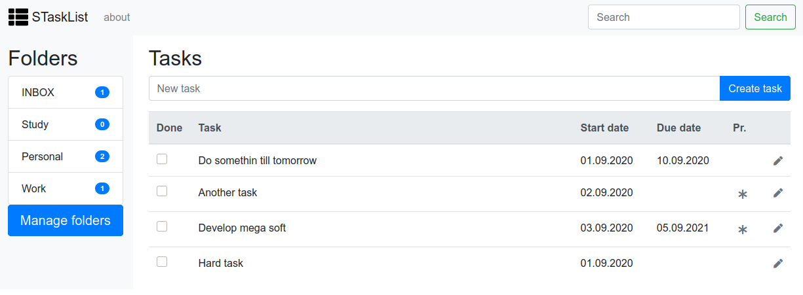

# STaskList
The "STaskList" is a learning web-app application for managing tasks.
It consists from two main entities "Folders" and "Tasks". 
Folder can include several tasks. Task describes some activity to do.



## Technical description

General characteristics of the application:
- Web-app
- Multi module Maven project
- Multi layer app (Model, DAO, DTO, Service, Web-app)
- Unit tests, integration test, mock

### Used technology

- Java 8
- Spring 5 (Core, MVC, Test)
- JUnit 5
- Maven 3.6.3
- Jetty 10.0.2
- H2 test database

## Development

### Requirements

- Java 8
- Maven 3.6.3

### Build

In root project folder invoke shell command
```shell
mvn clean istall
```

### Run

For run application invoke shell command
```shell
mvn jetty:run
```
Open application in browser by address `http://localhost:8080`

## Documentation

Folder `Documentation` contains next information:
- database - scripts for database creation and populate it with test data
- entities - project entities mind map
- ER_model - ER database diagram
- html_prototype - HTML application prototype
- SRS - software requirements specification
- vision - project vision mind map

You can open mind map files (with extension .mm) in documentation folders with application [Freeplane](https://www.freeplane.org/).

You can also see [wireframe prototype](https://www.figma.com/proto/Q1wFhwVUZdTQRC778gYffe/WebApp?node-id=19%3A1271&scaling=contain).