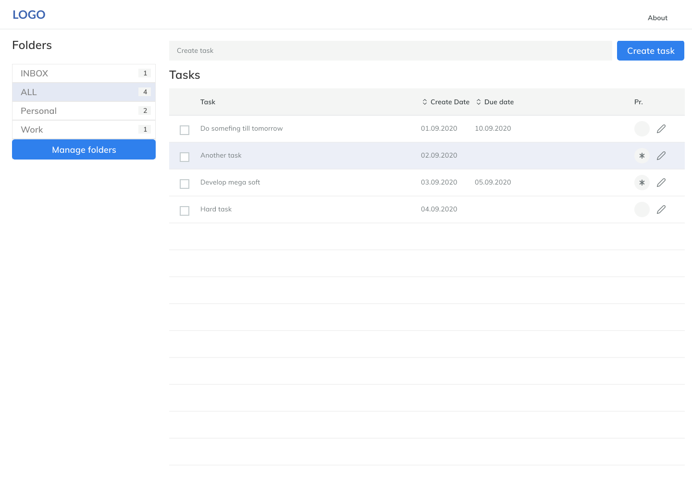
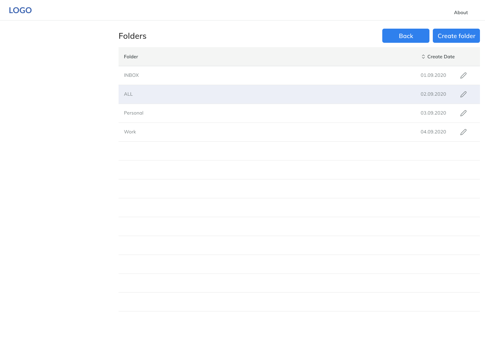
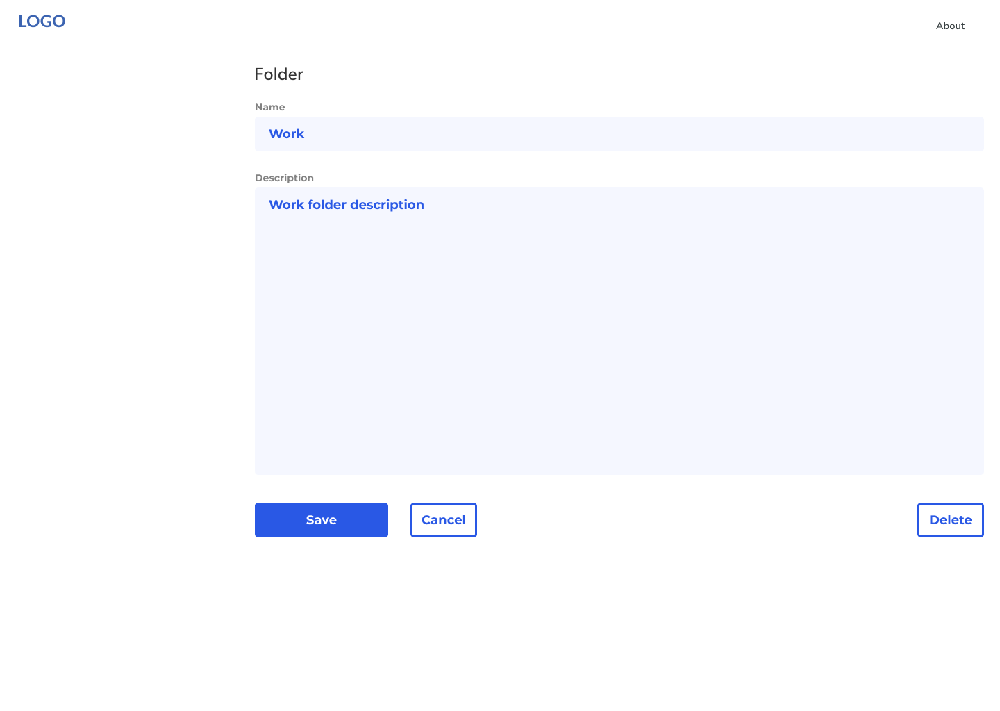
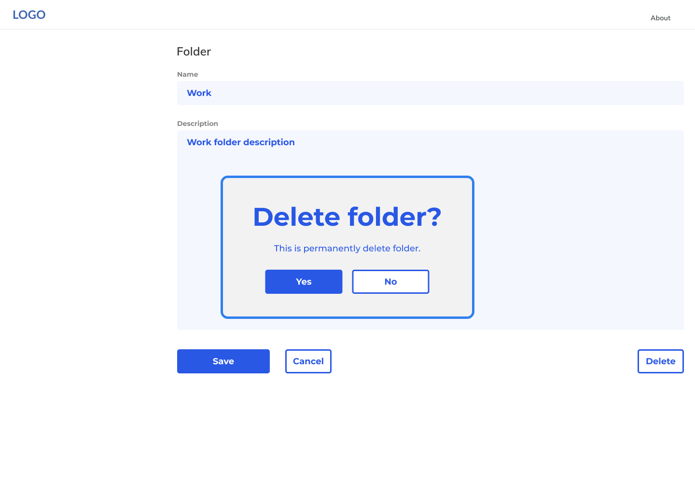
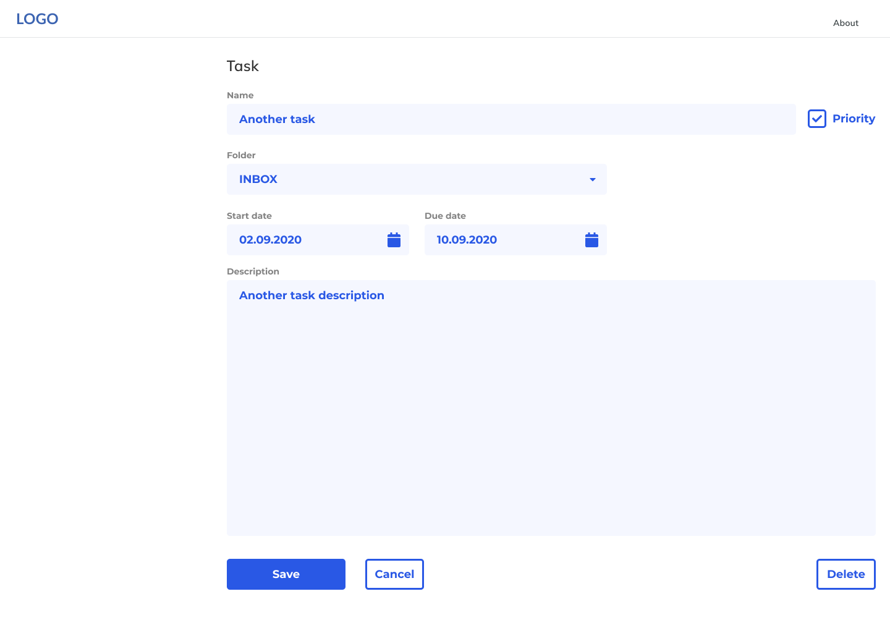

# Software requirements specification "STaskList"
v 1.0 - 22.09.2020

## Introduction

The SRS document captures the complete software requirements for the system. It captures all requirements in a single document.

### Purpose

This SRS describes the software functional and nonfunctional requirements for application "STaskList".  

### Scope

"STaskList" is software that will permit users to manage their tasks.
It have tasks, folders, filters. You can add, edit and delete each task. Folders uses to group tasks. Filter uses for filter tasks.

### Definitions, Acronyms, and Abbreviations
 
- VCS - Version Control System.

### References

No references are being used at this time.

### 1.5 Overview

The remaining part of this document provide a general description and the functional and data requirements of the product.  
General description of the project is discussed in section 2 of this document.  
Section 3 gives the functional requirements, data requirements,  constraints. It discusses the external interface requirements.   
Section 4 is for supporting information.

## 2. Overall Description

This document contains the problem statement for software "STaskList". It is list of task. It further lists and briefly describes the major features and a brief description of each one.

The following SRS contains the detail product perspective from different stakeholders. It provides the detail product functions of E-Store with user characteristics permitted constraints, assumptions and dependencies and requirements subsets.

## 3. Specific Requirements 

### 3.1 Functionality

#### 3.1.1 Main page (MP)

See Fig. 1.

##### 3.1.1.1 Main page folder list (MP-FL)

- (MP-FL) The system shall display all the folders list.
- (MP-FL-Cnt) The system shall display the count of tasks in folder.
- (MP-FL-Sel) The system shall allow user to select the folder.
- (MP-FL-Mng) The system shall enable user to manage the folders.

##### 3.1.1.2 Main page task list (MP-TL)

- (MP-TL) The system shall display all the tasks list of selected folder. It include follow information: task name, create date, due date, priority mark.
- (MP-TL-Add) The system shall allow user to add new task.	
- (MP-TL-Sel) The system shall allow user to select the task.
- (MP-TL-Edt) The system shall allow user to edit the task.
- (MP-TL-Done) The system shall allow user to done task by set checkbox.

#### 3.1.2 Folder list page (FLP)

See Fig. 2.

- (FLP) The system shall display all the folders list.
- (FLP-Add) The system shall allow user to add new folder.
- (FLP-Edt) The system shall allow user to edit folder.

#### 3.1.3 Folder edit page (FEP)

See Fig. 3.

- (FEP) The system shall display all folder information.
- (FEP-Edt) The system shall allow user to edit all folder information: name, description.

##### 3.1.3.1 Folder delete (FEP-Del)

See Fig. 3.1.

- (FEP-Del) The system shall allow user to delete folder after confirmation if folder don't have tasks.

#### 3.1.4 Task edit page (TEP)

See Fig. 4.

- (TEP) The system shall display all task information.
- (TEP-Edt) The system shall allow user to edit all task information: name, description, priority, folder, start date, due date.

##### 3.1.4.1 Task delete (TEP-Del)

- (TEP-Del) The system shall allow user to delete task after confirmation.

#### 3.1.5 Provide Search facility (SRH).

- (SRH) The system shall enable user to enter the search text on the screen.
- The system shall display all the matching tasks based on the search.
- The system shall notify the user when no matching task is found on the search.

### 3.2 Usability 

#### 3.2.1 Graphical User Interface

- The system shall provide a uniform look and feel between all the web pages.
- The system shall ask user confirmation before dangerous operations like "delete".

#### 3.2.2 Accessibility

- The system shall provide multi language support.
- The system shall be adoptive for different screen size, for example desktop, laptop, tablet and smartphone.

### 3.3 Reliability 

- The system shall provide storage of all databases on redundant computers with automatic switchover.
- The system shall provide for replication of databases to off-site storage locations.
- The system shall provide a contractual agreement with an internet service provider who can provide 99.99% availability through their network facilities onto the internet.

### 3.4 Performance

- The product shall be based on web and has to be run from a web server.
- The product shall take initial load time depending on internet connection strength which also depends on the media from which the product is run.
- The performance shall depend upon hardware components of the client/customer. 

### 3.5 Supportability

The source code developed for this system shall be maintained in VCS Git.

### 3.6 Design Constraints

#### 3.6.1 Back-end server side

The server side of software must be developed with Java using OpenJDK 8 or 11 and Spring Framework 5. It should use PostgreSQL database.

#### 3.6.2 Front/client side

The front/client side should use React or Angular or Vue.js

#### 3.6.3 General requirements

- Here are no memory requirements 
- The computers must be equipped with web browsers. 
- Response time for loading the application should take no longer than one minute. 
- A general knowledge of basic computer skills is required to use the application.

### 3.7 On-line User Documentation and Help System Requirements

To implement online user help, link "About" shall be provided. 

### 3.8 Purchased Components

Not Applicable

### 3.9 Interfaces

The protocol used shall be HTTP or HTTPS.
The Port number used will be 80 or 8080.

#### 3.9.1 User Interfaces

The user interface for the software shall be compatible to any modern  browser such as Google Chrome, Mozilla Firefox, Microsoft Edge by which user can access to the system.
The user interface shall be implemented using any tool or software.

#### 3.9.2 Hardware Interfaces

Since the application must run over the internet, all the hardware shall require to connect internet will be hardware interface for the system.

#### 3.9.3 Software Interfaces

Must have access to database PostgreSQL.

#### 3.9.4 Communications Interfaces

The system shall use the HTTP/HTTPS protocol for communication over the internet and for the intranet communication will be through TCP/IP protocol suite.

### 3.10 Licensing Requirements

Not Applicable

### 3.11 Legal, Copyright, and Other Notices

Not described yet in this document.

### 3.12 Applicable Standards

Not Applicable

## 4. Supporting Information

See also:  

- [Wireframe prototype](https://www.figma.com/proto/Q1wFhwVUZdTQRC778gYffe/WebApp?node-id=19%3A1271&scaling=contain)
- Vision of the project
- Project entities